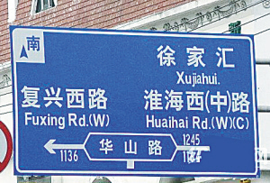
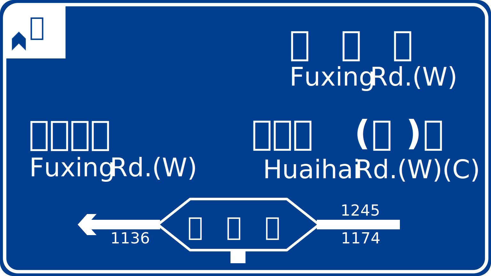

Real Image             |  SVG Version
:---------------------:|:---------------------:
  |  

# PypptRoadSign

 QXWZ Power Point Road Sign Project

# Very Basic Usage
from PypptRoadSign.sign import Sign

test_sign = Sign(background_style='default',width=16,height=9)

test_sign.background.draw()

test_sign.output('output.pptx')

